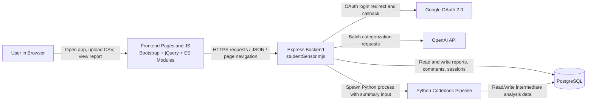

# StudentSensor

## App Summary
StudentSensor is a web application for turning raw BYU course evaluation exports into a readable report of themes and summarized student feedback. The main problem it solves is that faculty or academic staff should not have to manually read and categorize large sets of open-ended course comments one by one. The primary user is an instructor, department staff member, or analyst who has a CSV export of student ratings and wants a fast qualitative summary. A user signs in, uploads an evaluation file, and the system extracts the comments, stores them, categorizes them, and generates a report summary. The application is designed around the upload-to-report workflow, so the vertical slice is easy to test locally. It also supports multiple CSV delimiter shapes during upload so common export variations can still produce the same downstream comment data. The final result is a persisted report that can be reopened after refresh instead of being a one-time analysis.

## Tech Stack
- Frontend: server-rendered static HTML pages in `public/pages`, Bootstrap 5, Bootstrap Icons, jQuery, and browser-side ES modules such as `public/js/report_list_bootstrap.mjs`
- Frontend tooling: npm for dependency management
- Backend: Node.js with Express 5 and ES modules
- Session/auth middleware: `express-session` with `connect-pg-simple`
- Database: PostgreSQL accessed through the `pg` driver
- Authentication: Google OAuth 2.0
- CSV ingestion: `csv-parse`
- AI / analysis services: OpenAI API plus a local Python pipeline in `codebook_pipeline.py`
- Python dependencies: `openai`, `psycopg2-binary`, `python-dotenv`, and supporting libraries from `requirements.txt`
- Deployment artifacts in repo: `render-build.sh` for Render-style dependency install

## Architecture Diagram


## Prerequisites
Install the following software before running the project locally:

- Node.js 20+ and npm
  Official install guide: https://nodejs.org/en/download
  Verify:
  ```bash
  node --version
  npm --version
  ```
- Python 3.10+ and `pip`
  Official install guide: https://www.python.org/downloads/
  Verify:
  ```bash
  python --version
  pip --version
  ```
- PostgreSQL 14+ and `psql` available in your system `PATH`
  Official install guide: https://www.postgresql.org/download/
  Verify:
  ```bash
  psql --version
  ```
- A Google OAuth 2.0 application
  Official docs: https://developers.google.com/identity/protocols/oauth2
- An OpenAI API key
  Official docs: https://platform.openai.com/docs/overview

## Installation and Setup
1. Clone the repository and move into it.
   ```bash
   git clone <your-repo-url>
   cd studentsensor-main
   ```
2. Install Node dependencies.
   ```bash
   npm install
   ```
3. Create and activate a Python virtual environment.
   Windows:
   ```bash
   python -m venv venv
   venv\Scripts\activate
   ```
   macOS/Linux:
   ```bash
   python3 -m venv venv
   source venv/bin/activate
   ```
4. Install Python dependencies.
   ```bash
   pip install -r requirements.txt
   ```
5. Create a PostgreSQL database for the app.
   Example:
   ```bash
   createdb studentsensor
   ```
6. Run the schema file included in this repository.
   ```bash
   psql -d studentsensor -f config/mysql_structure.sql
   ```
7. Seed data:
   This repository does not currently include a separate `seed.sql` file. For local testing, create data through the app by signing in and uploading a CSV. If your course or deployment requires a seed file, add one and document that command here.
8. Create a `.env` file in the project root. You can start from `example.env` and fill in real values.
   Required values for local development are typically:
   ```env
   APP_PORT=3000
   APP_URL=http://localhost:3000
   GOOGLE_CLIENT_ID=your-google-client-id
   GOOGLE_CLIENT_SECRET=your-google-client-secret
   GOOGLE_CALLBACK_URL=http://localhost:3000/auth/google/callback
   SESSION_SECRET=your-session-secret
   DB_HOST=your-db-host
   DB_PORT=5432
   DB_NAME=studentsensor
   DB_USER=your-db-user
   DB_PW=your-db-password
   DB_SSL=false
   OPENAI_API_KEY=your-openai-api-key
   OPENAI_MODEL=gpt-4.1-mini
   OPENAI_TEMPERATURE=0.2
   OPENAI_MAX_TOKENS=300
   APP_CONFIG_KEYFILE=config/certs/server.key
   APP_CONFIG_CERTFILE=config/certs/server.crt
   NODE_ENV=development
   ```
9. Configure Google OAuth.
   Use a Web Application client in Google Cloud and add:
   ```text
   Authorized JavaScript origin: http://localhost:3000
   Authorized redirect URI: http://localhost:3000/auth/google/callback
   ```
10. If you plan to use the Render build flow, this repo includes `render-build.sh`, which installs both npm and Python dependencies.

## Running the Application
This project serves the frontend from the same Express server, so you only need to start one application process.

1. Activate the Python virtual environment if it is not already active.
2. Start the backend:
   ```bash
   node studentSensor.mjs
   ```
3. Open the app in your browser at:
   ```text
   http://localhost:3000
   ```
4. Sign in through Google OAuth, then go to the report list and create/upload a report.

## Verifying the Vertical Slice
Use these steps to verify the end-to-end upload and persistence workflow:

1. Start the app locally and open `http://localhost:3000`.
2. Sign in with Google.
3. Open the upload modal from the report list page.
4. Enter a professor name, course code, semester, and upload a BYU evaluation CSV.
5. Wait for processing to finish and confirm that the app navigates to a generated report page.
6. Confirm database writes with `psql`:
   ```sql
   SELECT rid, name, course_code, semester FROM reports ORDER BY rid DESC LIMIT 5;
   SELECT cid, rid, left(text, 80) FROM comments ORDER BY cid DESC LIMIT 10;
   SELECT rid, name FROM reports_settings ORDER BY rid DESC LIMIT 10;
   ```
7. Refresh the report page or return to the report list page and confirm the uploaded report is still present.
8. Open the same report again and verify that the comments and summary still render after reload, showing that the data persisted to PostgreSQL rather than only living in browser state.

## Live Version
If the deployed site is still active, the app can be accessed at:

https://studentratingsdashboard-backend.onrender.com

## Notes
- The backend accepts multiple CSV delimiter variants during upload and normalizes them into the same downstream comment structure.
- The frontend is served by Express from the `public/` directory; there is not a separate frontend dev server in this repository.
- The SQL bootstrap file is named `config/mysql_structure.sql` even though the active runtime database layer is PostgreSQL.
